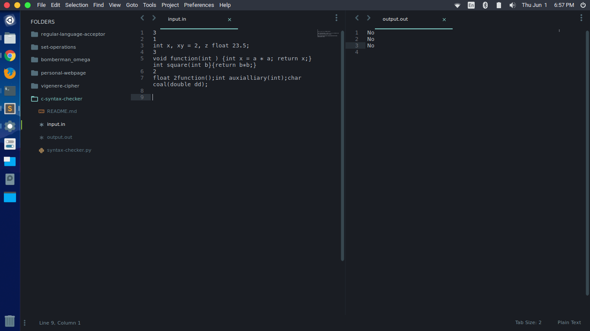

# c-syntax-checker

A simple syntax checker for the C programming language implemented using different finite state machines.

## A Machine Problem in CS 141 Automata and Language Theory

The program should ask the user to enter the name of the input file and the name of the output file as well.

The input file is going to contain a number of lines (written in c) that are any of the following:

variable declaration
function declaration/prototype
function definition
The output, which should be written to the output file, should say whether the test cases are valid or not.

The data types that will be involved are the primitive types int, float, double, and char.  Arrays may also be declared.

Sample Input:

3
1
int x, xy = 2, z float 23.5;
3
void function(int ) {int x = a * a; return x;} int square(int b}{return b*b;}
2
float 2function();int auxialliary(int);char coal(double dd);

Sample output:

No
No
No

## Screenshots

